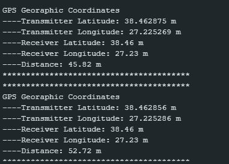
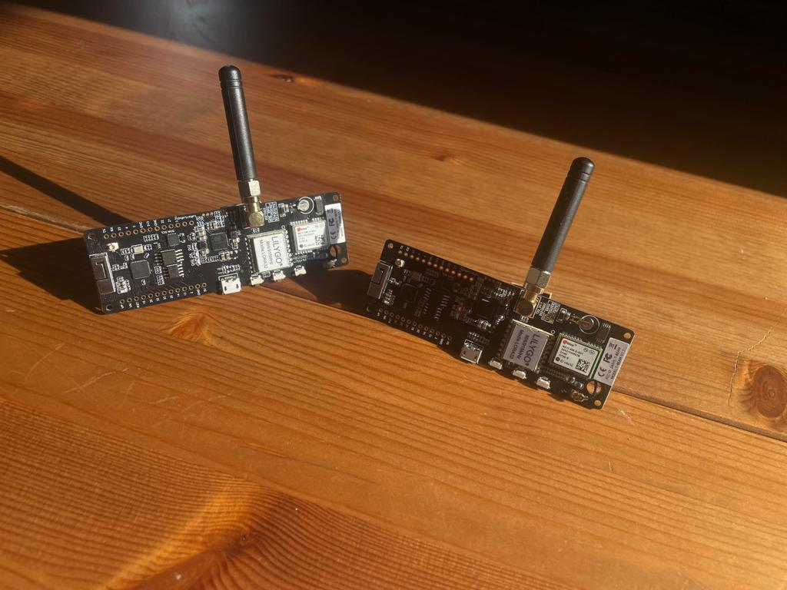

# V2V Smart Communication for Emergency Vehicles

## Overview
V2V Smart Communication for Emergency Vehicles is a project aimed at enabling wireless communication and location sharing among emergency vehicles. The system enhances the efficiency and effectiveness of emergency response by allowing vehicles such as ambulances and fire trucks to communicate with each other. It facilitates improved traffic coordination and enhanced safety measures.

The project utilizes LoRa (Long Range) wireless communication technology, which provides long-range coverage with low power consumption. It involves the use of LoRa modules, LoRa antennas, Arduino or similar microcontrollers, GPS modules, and OLED displays.

LoRa modules are responsible for wireless communication between emergency vehicles and a central control point. They offer the advantages of low power consumption and long-range communication capabilities. GPS modules accurately determine the location information of each vehicle, enabling real-time sharing of location data among the vehicles.

An Arduino or similar microcontroller is employed to control the system components. It facilitates the connection of LoRa modules and GPS modules, as well as the processing and display of received data. OLED displays are utilized to provide visual output of important information, allowing vehicles and the control center to read the received data, such as distance information.

## Features
- LILYGO T-BEAM-V1.1 and Arduino IDE is used 
- Wireless communication between emergency vehicles using LoRa technology
- Accurate location tracking and sharing through GPS modules
- Efficient traffic coordination and enhanced safety measures
- Real-time distance calculation and display
- Low power consumption and long-range communication

## Installation
1. Clone this repository.
2. Connect the LoRa modules, GPS modules, Arduino, and OLED displays as per the provided circuit diagram.
3. Upload the receiver code to the Arduino.
4. Upload the transmitter code to each emergency vehicle's Arduino.
5. Power up the devices and ensure they are within LoRa communication range.
6. The OLED displays will show the received distance information.

## Usage
- Ensure that the emergency vehicles are equipped with the necessary hardware components.
- Power on the devices and wait for the LoRa communication to establish.
- The vehicles will start communicating with each other and exchanging location data.
- The OLED displays will show the received distance information.
- Use the information to coordinate traffic and optimize emergency response.

# CODES

## Transmitter.ino
This code implements the functions of the LoRa transmitter. It includes the SPI and LoRa libraries. It sends packets over the LoRa module and increments a counter value with each transmission. It displays the counter value on the serial port and transmits the packet through the LoRa module to enable wireless communication. The purpose of the code is to send string data "packet 1," "packet 2," etc., to control the functionality of the antennas.

## Receiver.ino
This code implements the functions of the LoRa receiver. It includes the LoRa and Adafruit SSD1306 libraries. It uses the Wire library to scan I2C devices. It receives packets from the LoRa module, displays the received data on an OLED screen, and shows the content of the packet on the serial port. The purpose of the code is to receive and display the packets sent by the transmitter while controlling the functionality of the LoRa receiver.

## GPS-TRACKER.ino
This code is designed to control the operation of the GPS module. It reads GPS data to obtain location information. It uses the TinyGPS++ library and the HardwareSerial library. It reads serial data from the GPS module and, when a valid location fix is obtained, it displays the latitude, longitude, and altitude information on the serial port. The purpose of the code is to read and display GPS location data.

## Integrated Receiver and Transmitter
The code utilizes the LoRa library to establish long-range communication between the LoRa transmitter and receiver. LoRa (Long Range) technology enables reliable communication over long distances with low power consumption. The LoRa module is configured to operate at a frequency of 868MHz (BAND), which is a common frequency for LoRa applications in Europe.

The GPS module is connected to the receiver using a serial communication line. The TinyGPS++ library is used to decode the NMEA GPS data received from the module. The GPS data includes latitude and longitude information, as well as altitude.

In the main loop, the code checks for available GPS data by reading the GPSSerial. If valid GPS location data is received, it proceeds to check for incoming LoRa packets using the LoRa.parsePacket() function. If a packet is available, it reads the data using the readData() function.

The received packet contains the latitude and longitude information transmitted by the LoRa transmitter. The code extracts the latitude and longitude values from the packet using substring operations and converts them to floating-point values for further calculations.

To calculate the distance between the receiver and transmitter, the Haversine formula is used. The Haversine formula takes into account the curvature of the Earth and provides a reasonably accurate estimation of the distance between two points on the Earth's surface. The calculateDistance() function implements the Haversine formula and returns the distance in meters.

The calculated distance is then displayed on the OLED screen using the Adafruit SSD1306 library. The OLED screen is initialized with the appropriate settings, and the displayData() function is called to update the screen with the distance value.

In addition to the OLED display, the distance value is printed on the serial port for monitoring and debugging purposes. The receiver and transmitter coordinates, as well as the calculated distance, are printed on the serial port to provide a comprehensive view of the received data.

These technical details showcase how the code integrates LoRa communication, GPS data parsing, distance calculation, and display functionalities to create a complete system for wireless distance measurement using LoRa and GPS technologies.

## Acknowledgements
- [TinyGPS++ Library](https://github.com/mikalhart/TinyGPSPlus) - For GPS data parsing.
- [Adafruit SSD1306 Library](https://github.com/adafruit/Adafruit_SSD1306) - For OLED display support.
- [LoRa Library](https://github.com/sandeepmistry/arduino-LoRa) - For LoRa communication.

